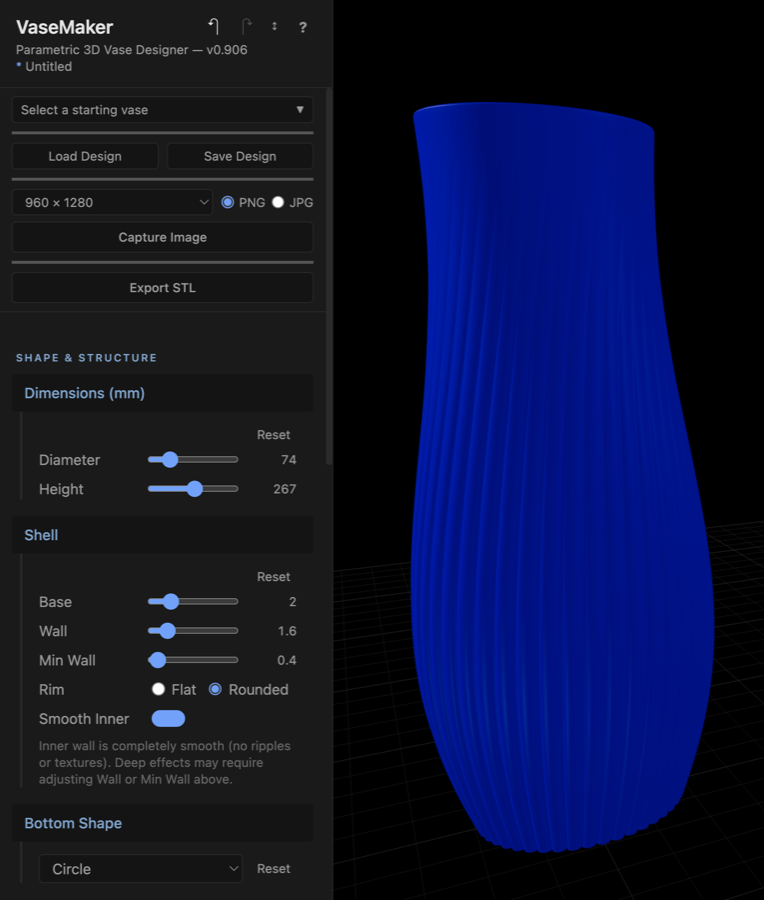
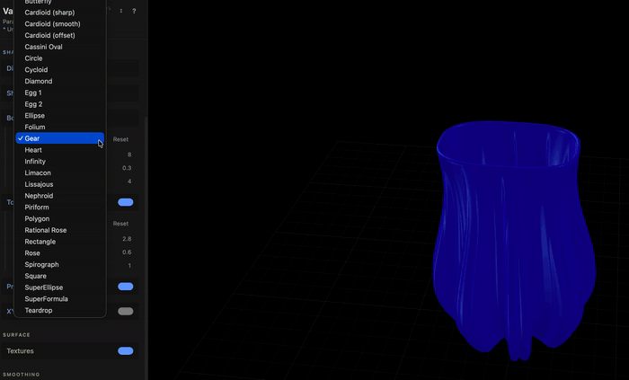
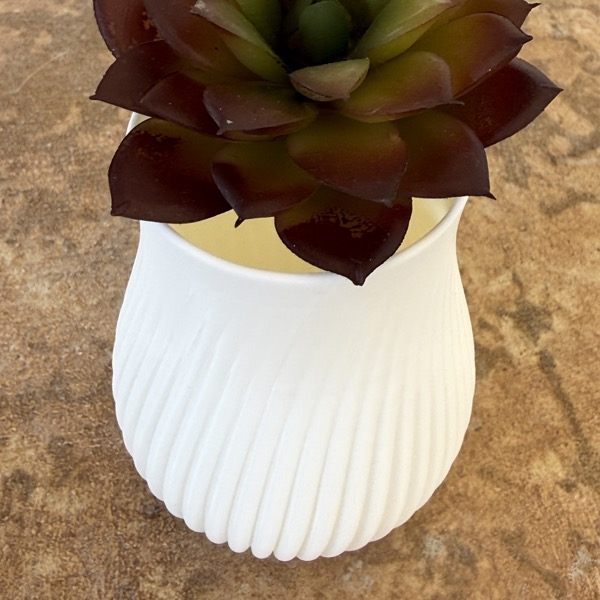
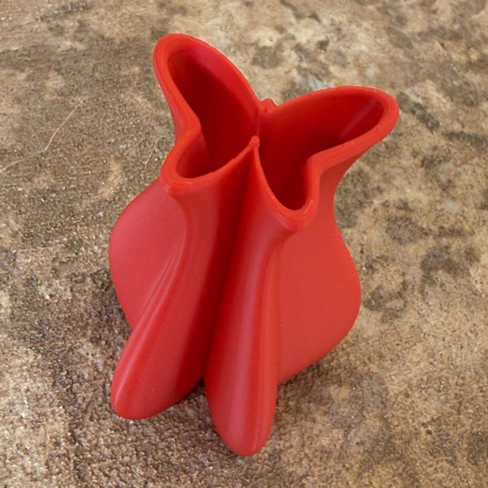
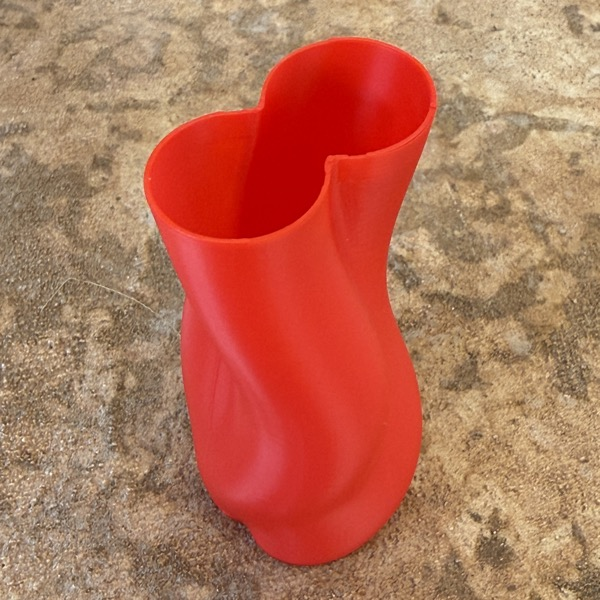
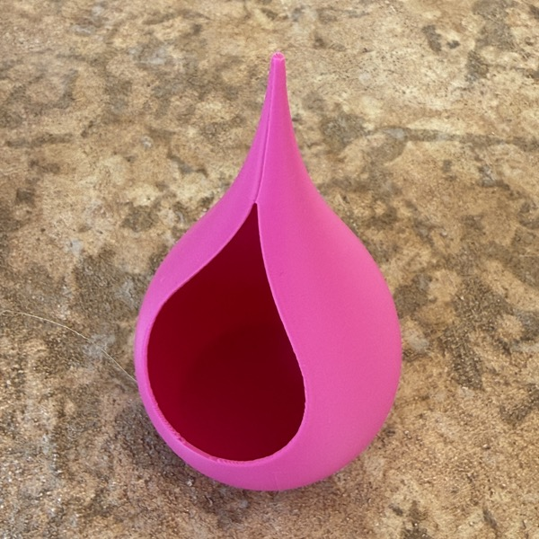
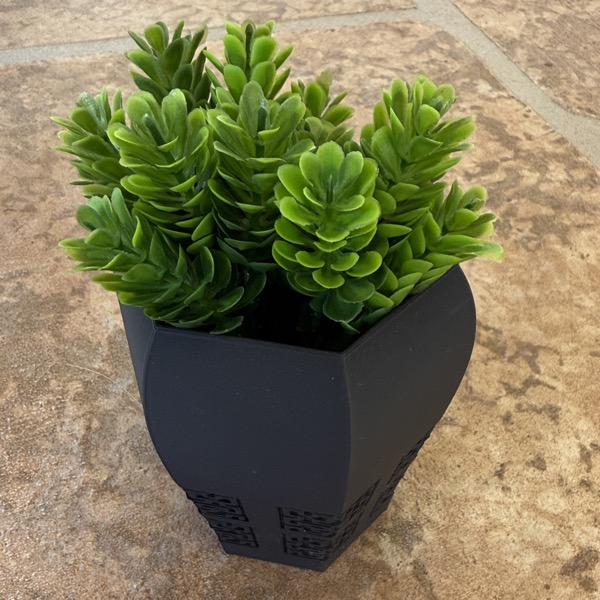
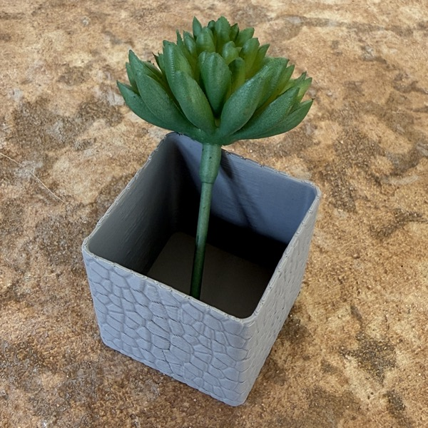
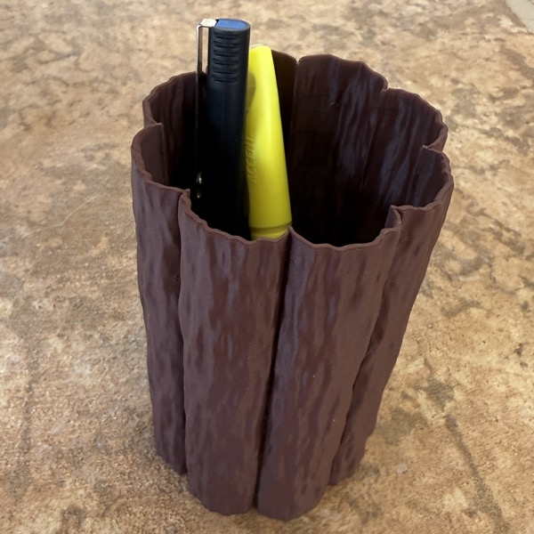
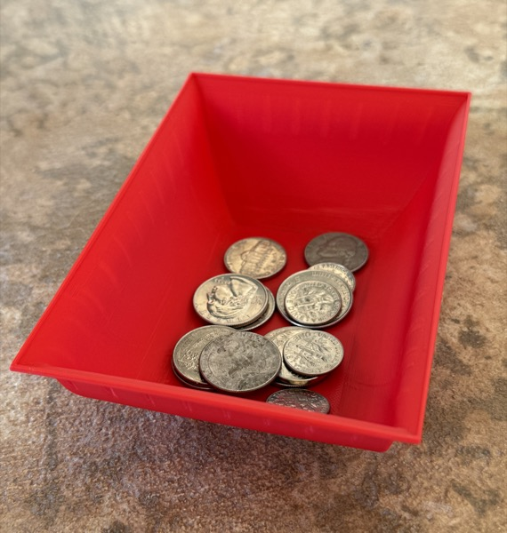

# VaseMaker

A browser-based parametric 3D vase designer. Create beautiful vases with 29 cross-section shapes, Bezier profile curves, 13 surface textures, twist, morphing, and more — then export STL files for 3D printing.

**[Use it now at vasemaker.dcity.org](https://vasemaker.dcity.org)** — no download or install required.

Create SVG texture patterns with our companion app **[PatternMaker](https://patternmaker.dcity.org)** — design a pattern there, then apply it as a surface texture on your vase.

<p align="center">

</p>

<p align="center">

</p>

## 3D Printed Examples

<table>
<tr>
<td align="center"><br><b>Classic Vase</b><br>Fluted texture with smooth zones</td>
<td align="center"><br><b>Butterfly Vase</b><br>Butterfly shape with twist</td>
<td align="center"><br><b>Heart Twins</b><br>Heart shape morphing with sway</td>
<td align="center"><br><b>Teardrop Lantern</b><br>Teardrop shape with cutout</td>
</tr>
<tr>
<td align="center"><br><b>Keyed Polygon</b><br>Polygon with SVG pattern cutout</td>
<td align="center"><br><b>Stone Box</b><br>Square shape with Voronoi texture</td>
<td align="center"><br><b>Wood Logs</b><br>Stipple texture pen holder</td>
<td align="center"><br><b>Fluted Tray</b><br>Rectangle shape, low profile</td>
</tr>
</table>

## Features

- **29 polar cross-section shapes** — Circle, Heart, SuperFormula, Gear, Cassini, and more
- **Bezier profile curve** — sculpt the vase outline with an interactive curve editor
- **Shape morphing** — smoothly blend between two shapes from bottom to top
- **13 surface textures** — Fluting, Voronoi, Simplex noise, Basket Weave, Stipple, SVG patterns, and more
- **Texture cutout** — punch holes through the wall for lattice/perforated designs
- **Twist & Sway** — custom Bezier twist, wave twist, and XY offset curves
- **Smooth zones** — suppress textures near base/rim for clean edges
- **Shell mode** — wall thickness, smooth inner wall, flat/rounded rim
- **Image capture** — save viewport screenshots as PNG/JPG at any resolution
- **STL export** — watertight mesh ready for slicing
- **Save/Load** — JSON design files, tiny and forward-compatible
- **50-step undo/redo** — Cmd+Z / Cmd+Shift+Z
- **Real-time preview** — instant feedback as you adjust parameters

## Getting Started

```bash
git clone https://github.com/dcityorg/vasemaker.git
cd vasemaker
npm install
npm run dev
```

Open [http://localhost:3000](http://localhost:3000) in your browser.

## Tech Stack

- [Next.js 14](https://nextjs.org/) (App Router, TypeScript)
- [Three.js](https://threejs.org/) via [@react-three/fiber](https://docs.pmnd.rs/react-three-fiber)
- [Zustand](https://zustand-demo.pmnd.rs/) for state management
- [Tailwind CSS](https://tailwindcss.com/) for styling
- Fully client-side — no backend required

## Project Structure

```
src/
├── engine/           # Pure math — mesh generation, shapes, STL export
├── components/
│   ├── editor/       # Main layout, sidebar, help panel
│   ├── parameters/   # All parameter UI controls (split by section)
│   └── viewport/     # 3D canvas, capture overlay/renderer
├── config/           # Slider ranges, colors, presets, viewport settings
├── store/            # Zustand stores (params + undo history)
├── presets/          # Default parameters and preset definitions
├── hooks/            # React hooks (mesh generation bridge)
├── content/          # Help panel text content
└── lib/              # Utilities (math, download helpers)
```

## How It Works

```
User adjusts slider → Zustand store → useVaseMesh hook →
generateMesh() → Float32Array positions/normals + indices →
VaseMesh.tsx updates BufferGeometry → Three.js renders
```

The engine uses polar cross-section shapes swept along a Bezier vertical profile. Each vertex is computed from: shape function × profile radius + texture offsets, then converted from polar to cartesian coordinates with twist rotation applied.

## License

[MIT](./LICENSE)
